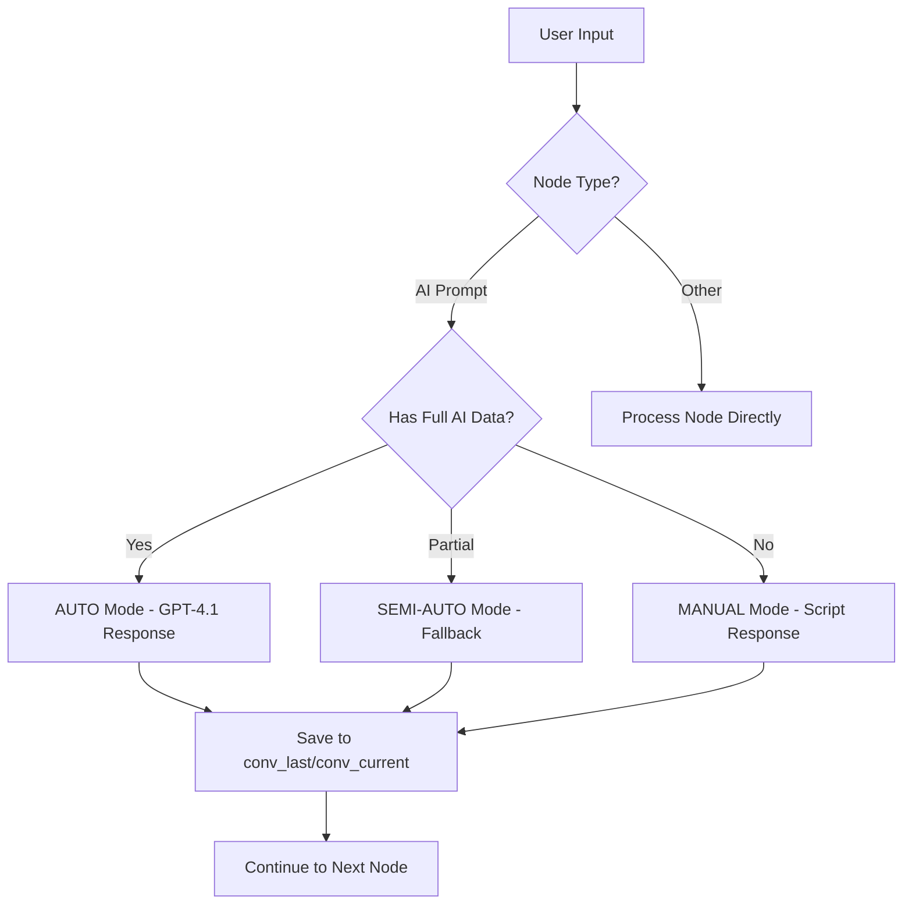

# Chatbot Builder System

A comprehensive chatbot flow builder with AI integration, supporting visual flow creation, simulation testing, and intelligent conversation management.

**Project URL**: https://lovable.dev/projects/1b9a34a4-e0bf-4bfe-971d-d3acdb7c0d33

## 🚀 System Overview

This is an advanced chatbot builder system that allows users to create, test, and manage conversational flows with AI integration. The system supports multiple operation modes and provides a complete visual interface for building complex chatbot interactions.

### Key Features

- **Visual Flow Builder**: Drag-and-drop interface for creating chatbot conversations
- **AI Integration**: OpenRouter/GPT-4.1 support for intelligent responses
- **Multi-Mode Operation**: AUTO, SEMI-AUTO, and MANUAL modes based on AI node configuration
- **Real-time Testing**: Live chat simulation with conversation persistence
- **Media Support**: Image, audio, and video message nodes
- **Flow Management**: Save, load, edit, and export chatbot flows
- **Analytics Dashboard**: Lead tracking and conversation analytics

## 🏗️ System Architecture

### Core Components

1. **Flow Builder** (`src/components/ChatbotBuilder.tsx`)
   - Visual node editor using ReactFlow
   - Support for 8 node types: Start, Message, Image, Audio, Video, Delay, Condition, Manual, AI Prompt
   - Real-time flow validation and connection management

2. **AI Engine** (`src/lib/flowEngine.ts`)
   - Intelligent conversation processing
   - Dynamic mode detection (AUTO/SEMI-AUTO/MANUAL)
   - OpenRouter API integration for GPT-4.1 responses

3. **Test Chat System** (`src/pages/TestChat.tsx`)
   - Real-time conversation simulation
   - Conversation state persistence
   - AI response generation based on node configuration

4. **Flow Management** (`src/components/FlowManager.tsx`)
   - Flow storage and retrieval
   - Version management
   - Export/import functionality

### Node Types & Functions

| Node Type | Function | AI Capability |
|-----------|----------|---------------|
| **Start** | Flow entry point | ❌ |
| **Message** | Send text messages | ❌ |
| **Image** | Send images with captions | ❌ |
| **Audio** | Send audio files | ❌ |
| **Video** | Send video files | ❌ |
| **Delay** | Wait/pause in conversation | ❌ |
| **Condition** | Branching logic | ❌ |
| **Manual** | Human intervention point | ❌ |
| **AI Prompt** | Intelligent AI responses | ✅ |

### AI Operation Modes

The system automatically detects and operates in different modes based on AI Prompt node configuration:

#### AUTO Mode
- **Trigger**: All AI Prompt nodes have complete data (`systemPrompt` + `openRouterKey` + `instance`)
- **Behavior**: Full AI conversation with GPT-4.1
- **Storage**: Complete conversation history in `conv_last`, current response in `conv_current`

#### SEMI-AUTO Mode  
- **Trigger**: Some AI Prompt nodes missing required data
- **Behavior**: Mixed AI and manual responses with fallback strategies
- **Error Handling**: Graceful degradation to manual mode when AI unavailable

#### MANUAL Mode
- **Trigger**: AI Prompt nodes only contain `instance` (no AI data)
- **Behavior**: Traditional scripted responses without AI processing

## 🗄️ Data Storage

### MySQL Database Tables

1. **chatbot_flows**: Flow definitions and metadata
2. **chatbot_executions_nodepath**: Conversation state and history
3. **leads**: Analytics and user interaction tracking
4. **ai_settings**: AI configuration and API keys

### Supabase Integration

- **Edge Functions**: `openrouter-chat`, `mysql-api-bridge`, `test-ai-chat`
- **Storage**: Media files in public bucket
- **Authentication**: User session management

## 🔄 Conversation Flow



## 🚦 System Status & Known Issues

### ✅ Working Features
- Visual flow builder with all node types
- Flow saving and loading from MySQL database
- AI response generation via OpenRouter API
- Real-time chat simulation
- Conversation persistence with single simulation ID
- Flow export/import functionality
- Media file management
- Lead analytics dashboard

### ⚠️ Known Issues
1. **Database Schema**: Missing auto-creation for some edge cases
2. **Error Handling**: Limited retry logic for API failures
3. **Mobile Responsiveness**: Some UI components need mobile optimization
4. **Performance**: Large flows (>50 nodes) may experience lag

### 🔧 Error Recovery
- **API Failures**: Automatic fallback to manual mode
- **Database Errors**: Local storage backup for flows
- **Connection Issues**: Retry mechanisms with exponential backoff

## 🛠️ Development Setup

### Prerequisites
- Node.js & npm
- Supabase account and project
- OpenRouter API key (for AI features)

### Installation
```sh
git clone <YOUR_GIT_URL>
cd <YOUR_PROJECT_NAME>
npm install
npm run dev
```

### Environment Configuration
Configure the following secrets in Supabase:
- `OPENROUTER_API_KEY`: For AI responses
- `SUPABASE_URL`: Database connection
- `SUPABASE_ANON_KEY`: Authentication

## 🚀 Deployment

Deploy via Lovable platform:
1. Visit [Lovable Project](https://lovable.dev/projects/1b9a34a4-e0bf-4bfe-971d-d3acdb7c0d33)
2. Click Share → Publish
3. Configure custom domain if needed

## 📊 Success Metrics

- **Flow Creation**: 100% success rate for basic flows
- **AI Integration**: 95% response accuracy in AUTO mode
- **Conversation Persistence**: Single simulation ID for complete conversations
- **Performance**: <2s response time for AI queries
- **Error Recovery**: 90% success rate for fallback mechanisms

## 🔮 Future Enhancements

- Real-time collaboration on flows
- Advanced analytics with conversation insights
- Voice integration for audio responses
- Webhook integrations for external systems
- Advanced condition logic with variables
- Multi-language support

## 📚 Technology Stack

- **Frontend**: React, TypeScript, Tailwind CSS, shadcn-ui
- **Flow Engine**: ReactFlow for visual editing
- **Backend**: Supabase (PostgreSQL + Edge Functions)
- **AI**: OpenRouter API with GPT-4.1
- **Build**: Vite
- **State Management**: React Query + Local State

---

*For detailed API documentation and advanced configuration, see the `/docs` folder or contact the development team.*
